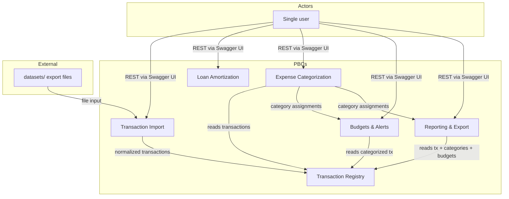
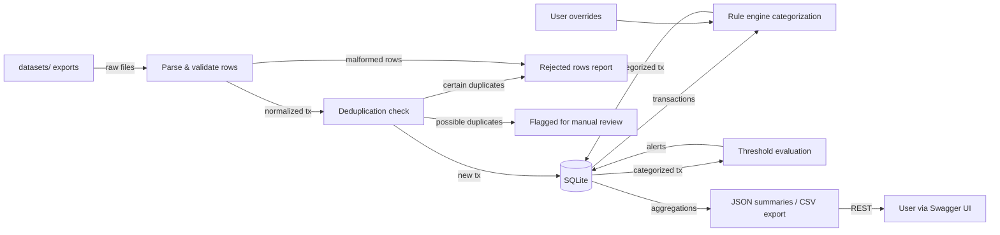
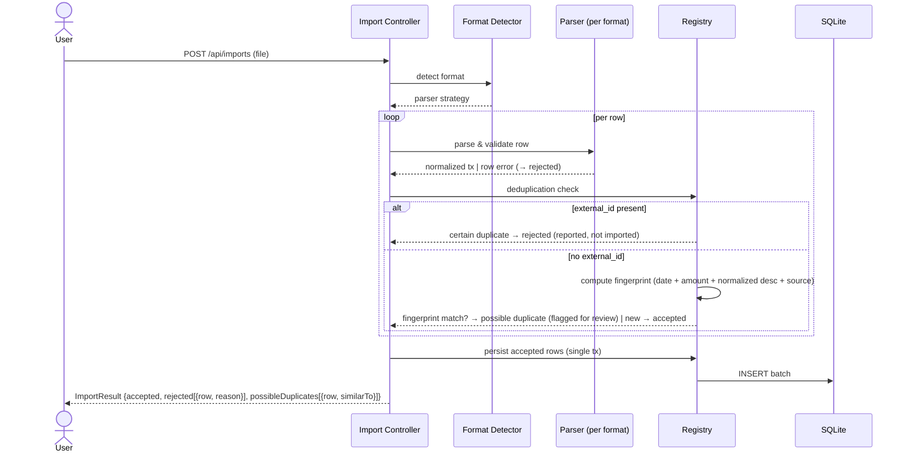

# 6 — Software Architecture

## 6.1 PBCs — High-Level Diagram

The system is decomposed into six bounded contexts (PBCs) inside a single Spring Boot application. The dependency graph is deliberately clean: **Import → Registry ← {Categorization, Budgets, Reporting}** — no module other than Import writes transactions, and no module depends on Import to read them.

> *Auto-generated from PB content — confirmed with the user (2026-09-14).*



### PBC Descriptions

| PBC | Responsibility | Owns |
|-----|---------------|------|
| **Transaction Import** | Parse ≥3 export formats (CSV/JSON), normalize to the common model, validate rows, report malformed rows | Format parsers (strategy per format), normalization rules, `ImportResult` |
| **Transaction Registry** | Own the common transaction model and its SQLite persistence; deduplicate on import | Transaction entities, repository, deduplication logic |
| **Loan Amortization** | Compute fixed-installment (French system) amortization schedules | Loan parameters, schedule, rate/rounding conventions |
| **Expense Categorization** | Assign categories via ordered deterministic rules; persist user corrections as learned overrides | Rules catalog, overrides store |
| **Budgets & Alerts** | Track budgets per category with statistical thresholds; monthly digest; threshold alerts | Budget definitions, threshold logic, generated alerts |
| **Reporting & Export** | Aggregate JSON summaries (monthly balance, spending by category, trends) and CSV export | Aggregation queries, CSV writer |

**Design note — why Registry is separate from Import:** if Import owned the transactions table, Categorization, Budgets, and Reporting would all depend on Import solely to read data — coupling three unrelated modules to a component whose actual task is multi-format parsing. With a separate Registry the graph stays clean. Additionally, **deduplication at import time is in scope** (re-importing overlapping date ranges from different files is a plausible scenario): it is genuine domain logic that belongs in Registry, and alone justifies the module as a distinct bounded context rather than a CRUD wrapper.

## 6.2 Architecture Patterns

| Pattern | Rationale | Where |
|---------|-----------|-------|
| **Modular monolith** | Single Spring Boot app; local-first, single user — distribution would be unjustified complexity | Whole application |
| **Lightweight hexagonal** (principle 1, `05-principles.md`) | Pure domain core, adapters at the edges; no dedicated ports/adapters packages until complexity justifies them | Each module |
| **Repository pattern** | Parameterized JDBC behind interfaces; keeps SQL out of the domain | Persistence adapters |
| **Strategy pattern** | One parser implementation per export format behind a common interface | Transaction Import |
| **Rule engine (ordered, deterministic)** | Categorization as an ordered list of rules; first match wins; overrides applied last | Expense Categorization |
| **Synchronous REST only** | No async messaging — no stated NFR demands it (YAGNI, principle 5) | API layer |

**Rejected alternatives:**

| Alternative | Why rejected |
|-------------|-------------|
| Microservices | No distribution, scaling, or team-autonomy need; local-first single-user app |
| Event-driven / messaging (Kafka, RabbitMQ) | No async NFR; adds a broker dependency violating local-first |
| CQRS | Read/write volumes are trivial; separate models would be ceremony |
| Multi-module Maven build | Single developer, single artifact — package boundaries + ArchUnit give the same discipline without build overhead (see §6.3.4) |

## 6.3.1 PBC Detail

Each PBC follows the same internal shape — `api` (REST controller) / `domain` (pure Java) / `infrastructure` (JDBC adapter) — per the code strategy in §6.3.4.

| PBC | API surface (REST) | Domain core (pure Java) | Infrastructure adapter |
|-----|--------------------|--------------------------|------------------------|
| Transaction Import | `POST /api/imports` (multipart file upload) | Format detection, row parsing, validation, `ImportResult` aggregation | File reading; delegates persistence to Registry |
| Transaction Registry | `GET /api/transactions` (filter by date/category) | Common transaction model, deduplication rules | SQLite repository (parameterized JDBC) |
| Loan Amortization | `POST /api/loans/schedule` | French-system schedule math (`BigDecimal` only) | None — pure computation, no persistence |
| Expense Categorization | `GET/PUT /api/transactions/{id}/category` | Ordered rule engine, override resolution | Rules + overrides SQLite repository |
| Budgets & Alerts | `GET/PUT /api/budgets`, `GET /api/alerts` | Statistical threshold logic (see algorithm below), digest computation | Budgets SQLite repository |
| Reporting & Export | `GET /api/reports/*` (JSON), `GET /api/reports/export?format=csv` | Aggregation logic | Read queries via Registry repository; CSV writer |

#### Budgets & Alerts — Threshold Algorithm (formal definition)

**Owner:** Budgets & Alerts PBC (§6.1). **Reference:** `BUDGET.threshold_policy` in `08-data-architecture.md`.

**Method:** moving average over the last N months by category, with threshold at k·σ (standard deviation over the same window). An alert fires when the current month's spending in a category exceeds:

```
alert_threshold(category) = moving_average(category, N) + k · σ(category, N)
```

**Parameters (exposed as configuration, not constants):**

| Parameter | Default | Meaning |
|-----------|---------|---------|
| N | 6 months | Moving window for both average and σ |
| k | 2 | Threshold multiplier (configurable) |

**Minimum data requirement:** no alerts for a category until **at least 3 months of history** exist for it — with fewer observations, average and σ are unreliable and would produce false positives.

**Why moving average + k·σ and not percentiles:** with a single user and monthly granularity, the number of observations per category in the early months is too low for a stable percentile calculation; average and standard deviation remain interpretable even with few points.

**Behavior:** the current month's spending per category is evaluated against the threshold; exceeding it produces an **anomaly alert** (persisted by the module, exposed via `GET /api/alerts`). The monthly digest reuses the same per-category aggregates.

**Relationship with `limit_amount`:** the statistical threshold and the optional per-category `limit_amount` are **independent, complementary mechanisms** (see `08-data-architecture.md` modeling notes). `limit_amount`, when set, triggers a dedicated "budget exceeded" alert; the statistical threshold runs in parallel regardless. Both alerts can coexist for the same month/category — different natures (self-imposed target vs. anomaly vs. own history), both displayed, no reconciliation.

## 6.3.2 Key PBCs — Reference Design

**Status:** `[TBD — see Open Items]` for the per-PBC reference designs. This subsection was planned (per the ASD template: "Key/Core PBCs — Reference or Base Design") but never written; the numbering gap it left has been preserved to keep all cross-references stable.

**Technology Stack Summary** (consolidated from PB §6 and decisions confirmed in conversation — a reader of section 6 alone should see the complete technology picture):

| Layer | Technology |
|-------|-----------|
| Frontend | None — no graphical UI; Swagger UI (springdoc-openapi) is the reference API consumer |
| Backend | Java 21 + Spring Boot 3.4.0 (REST, springdoc-openapi for Swagger UI) |
| Primary Database | SQLite (embedded file) via `org.xerial:sqlite-jdbc` — production and integration tests |
| Cache | None (N/A — local single-user, YAGNI) |
| Messaging | None (synchronous REST only — see §6.2) |
| Container Orchestration | None (N/A — runs on the personal machine, §7) |
| CI/CD | None — manual delivery workflow (§9) |
| Monitoring | None (N/A — §7.5) |
| Build | Maven (single module — multi-module rejected, §6.2) |
| Testing | JUnit 5, Mockito, MockMvc, ArchUnit (§10.3) |

**Per-PBC reference designs:** `[TBD — see Open Items]` — which key PBCs (candidates: Transaction Import, Budgets & Alerts) warrant a documented reference design beyond the per-PBC detail already in §6.3.1 was never discussed. To be defined before implementation planning.

## 6.3.3 Data Strategy

**Data ownership model:** **shared database** — a single SQLite file owned by the application, with **logical ownership per PBC** (each context has its own tables; no cross-module table writes). Database-per-service is rejected: one embedded file, one process, one user — separate databases would be ceremony without benefit.

| PBC | Primary Data Store | Data It Owns |
|-----|--------------------|--------------|
| Transaction Import | — (stateless; results persisted via Registry) | Nothing persisted |
| Transaction Registry | SQLite — `transactions` table | Common transaction model, dedup keys |
| Loan Amortization | — (pure computation) | Nothing persisted |
| Expense Categorization | SQLite — `category_rules`, `category_overrides` tables | Rules catalog, learned overrides |
| Budgets & Alerts | SQLite — `budgets`, `alerts` tables | Budget definitions, thresholds, generated alerts |
| Reporting & Export | — (read-only over other contexts' data) | Nothing persisted |

**Cross-PBC data flow:**
- Import → Registry: normalized transactions (in-process method call, same transaction boundary as the import batch).
- Categorization / Budgets / Reporting → Registry: read transactions via repository interfaces.
- Categorization → Budgets / Reporting: category assignments read via Registry queries.

**Analytics / data platform integration:** none — out of scope (local-first; see `04-constraints.md`).

**Consistency strategy:** SQLite ACID transactions; **an import batch is a single transaction** (all accepted rows commit together, or nothing does). No eventual consistency, no sagas — single process, single connection pool.

## 6.3.4 Code Strategy

**Architectural pattern per PBC:** lightweight hexagonal (principle 1) — within each package-per-context module:

```
com.finance.<context>/
├── api/           REST controllers (Spring)
├── domain/        Pure Java: entities, value objects, services (no Spring, no JDBC)
└── infrastructure/ JDBC repositories, mappers (Spring @Repository)
```

**Maven structure (final decision):** single Maven module, package-per-context. A multi-module build would add POMs, wiring, and build time for zero benefit with one developer and one deployable artifact.

**Boundary enforcement:** **ArchUnit tests** enforce module discipline at the test level, achieving multi-module rigor without multi-module overhead. Canonical rules:
- No package outside `*.infrastructure` may reference JDBC classes (`java.sql.*`, `org.springframework.jdbc.*`).
- Only repository interfaces cross package boundaries — no concrete adapter types leak into `domain` or `api`.
- `domain` packages import nothing from `api` or `infrastructure`.
- No cross-context access to another context's `infrastructure` package.

**Key business logic requiring architectural guidance:**
- **Amortization calculator:** pure `BigDecimal` math (principle 2); rate convention and rounding policy are **decided**: nominal annual rate (TAN) converted to the installment period; half-up rounding to 2 decimal places per individual installment; accumulated rounding difference applied to the final installment. Exhaustive unit tests on rounding edge cases (see `10-testing.md`).
- **Import parsers:** strategy interface per format; each parser returns typed row results; `ImportResult` distinguishes three per-row outcomes (principle 3): **accepted**, **rejected** (with reason), and **possible duplicate** (fingerprint match without `external_id` — flagged for review, never auto-rejected; see dedup rules in `08-data-architecture.md`).
- **Categorizer rule engine:** ordered deterministic rules, first-match-wins; user corrections persist as overrides that take precedence over rules.
- **Registry deduplication:** deterministic duplicate detection on re-import of overlapping date ranges (e.g., natural key on source + external id + date + amount); duplicates are reported, not silently merged.

**Integration patterns to enforce:**
- Transaction boundary at the import batch level (single ACID transaction).
- All persistence through repository interfaces (parameterized statements only — see `03-nfr.md` §3.4).
- No `double` in the money path (principle 2) — enforced in code review and ArchUnit where feasible.

## 6.3.5 Integration Strategy

**Synchronous communication:** in-process method calls between PBCs via domain interfaces; REST (JSON) at the system boundary only.
**Asynchronous communication:** none — no message broker, no event stream (YAGNI; see §6.2).

**Key integrations:**

| Integration | Type | Protocol | Risk Notes |
|-------------|------|----------|-----------|
| User ↔ API (Swagger UI) | sync | HTTP/REST (localhost) | None — localhost binding (§3.4) |
| `datasets/` files → Import | file input | CSV / JSON file parsing | Malformed rows handled per-row (principle 3); format drift in sample files is the main risk |

**Integration policies:**
- **Versioning:** N/A — no external API consumers; REST contract is internal to the course project.
- **Idempotency:** import deduplication (Registry natural key) makes re-importing overlapping files safe.
- **Circuit breaking:** N/A — no remote calls at runtime.

## 6.4 Selected Views

### Data Flow View (mandatory)

End-to-end data movement: import → persist → categorize → budget/report.

> *Auto-generated from PB content — confirmed with the user (2026-09-14).*



### Import Flow Sequence (targeted)

The only multi-step flow with enough branching to justify a sequence diagram: format detection → row-by-row parsing/validation → Registry deduplication → aggregation into `ImportResult` → HTTP response.

> *Auto-generated from PB content — confirmed with the user (2026-09-14).*



**`ImportResult` legend — three per-row outcomes** (principle 3; dedup rules in `08-data-architecture.md`):
- **accepted** — row imported (committed in the single batch transaction)
- **rejected** — malformed row or certain duplicate (`external_id` match); reported with reason, never imported
- **possible duplicate** — fingerprint match without `external_id`; **not imported automatically**, flagged as "possible duplicate of transaction #X" for explicit manual review
