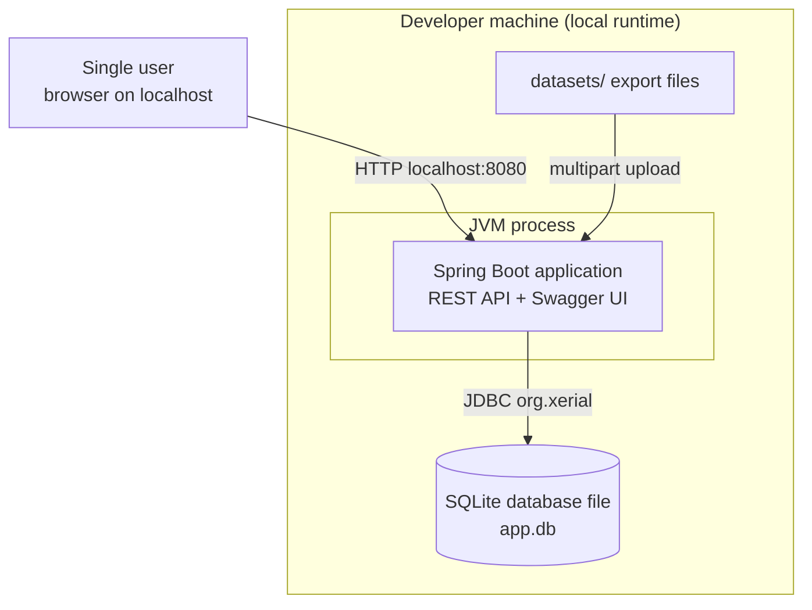

# 7 — Infrastructure Architecture

**Framing:** this is an **on-premises (personal machine) project** — deliberately. The local-first constraint (`04-constraints.md`) and the absence of any production deployment (PB §4) mean there is no cloud footprint, no environments matrix, and no deployment infrastructure. This section documents the local runtime honestly and marks everything else N/A — a minimal section by design, not by omission.

## 7.1 Main Infrastructure Diagrams

> *Auto-generated from PB content — confirmed with the user (2026-09-14).*

**Cloud provider(s):** none — on-premises (developer machine).
**Regions:** N/A.
**Network topology summary:** single process bound to `localhost`; no external network reachability (§3.4).
**Cross-cutting components:** none — no load balancer, gateway, WAF, CDN, or identity provider.
**On-prem / third-party connectivity:** none.

## 7.2 Main Infrastructure Description

| Component | Decision | Rationale | NFR / Constraint addressed |
|-----------|----------|-----------|---------------------------|
| Compute | Single JVM process (Spring Boot embedded Tomcat) | One deployable artifact; no orchestration | Local-first constraint; zero cost (§4.3) |
| Database | SQLite file via JDBC (`org.xerial:sqlite-jdbc`) | Embedded, zero-admin, single-file backup | Local-first constraint; RPO/RTO (§3.2) |
| Network | Bind to `localhost` only | No auth model; API must not be reachable from other machines | Security posture (§3.4) |
| Storage | Local filesystem only (DB file + log file) | No object storage, no network shares | Zero cost; local-first |
| Runtime sizing | Default JVM heap; no tuning | Volumes are trivial (§3.1); tuning would be premature | YAGNI (principle 5) |

**Availability/reliability:** no redundancy by design — the SQLite file is the unit of backup (file copy), restart is the recovery path (§3.2). **Security:** localhost binding + parameterized SQL + input validation (§3.4); no encryption in transit or at rest required.

## 7.3 Infrastructure for QA Automation

**Test types supported:** unit (domain), integration (importer + persistence against real SQLite), E2E (1–2 full-flow scenarios via MockMvc/REST Assured — see `10-testing.md`).
**Infrastructure:** the developer machine — tests run in the Maven build (Surefire/Failsafe); no dedicated test environment, no containers (Testcontainers dropped — CONCERN-002 resolved).
**QA tech stack constraints:** JUnit 5, Mockito, MockMvc / REST Assured (per `01-context.md`).
**Performance testing environment:** none dedicated — the two NFR targets (§3.1) are verified as part of the test suite on the local machine.

## 7.4 Infrastructure for CI/CD Pipelines

**CI/CD platform:** none — no pipeline infrastructure exists or is required (no production deployment; PB §4). Version control is GitHub (course repository), used for branch/PR workflow only.
**Pipeline execution:** N/A.
**Artifact / image registries:** N/A — the artifact is the local build (`mvn package`).
**Environments managed:** none — the developer machine is the only environment.
**IaC pipeline:** none.

## 7.5 Infrastructure for Operations

**Metrics:** none (§3.3 — out of scope).
**Logging:** Spring Boot console + file logging (Logback) — the only observability.
**Tracing:** none.
**Dashboards:** none.
**Alerting / on-call:** none.
**Incident management:** N/A — local single-user tool; recovery = restart app / restore DB file copy.

## 7.6 Infrastructure for Frontend

No frontend component — Swagger UI is served by the Spring Boot application itself (springdoc-openapi). Not applicable.

## 7.7 Other Auxiliary Infrastructure

None. No background-job infrastructure (all processing synchronous, in-request), no ML serving, no developer tooling beyond the standard JDK + Maven toolchain.
