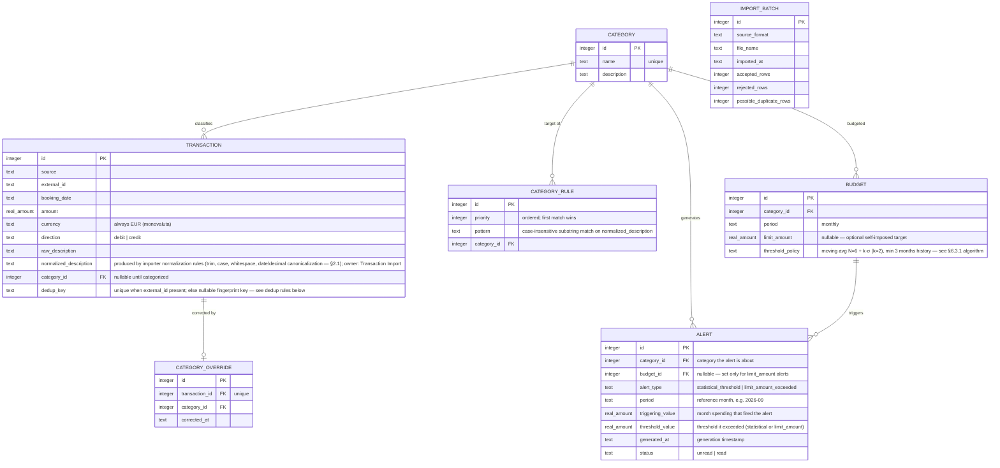

# 8 — Data Architecture

**Scope:** Not applicable as an analytics/data-platform section — this is a purely transactional system with no data lake, warehouse, BI platform, or ML consumption (local-first constraint, `04-constraints.md`; PB §4). Operational data ownership and flow are covered in `06-software-architecture.md` §6.3.3. This section documents the core entity model for downstream planning, then explicitly marks the analytics concerns out of scope.

## Core Entity Model

> *Auto-generated from PB content — confirmed with the user (2026-09-14).*

**Modeling notes:**
- `amount` is `BigDecimal` + `Currency` in the domain (principle 2, `05-principles.md`); the SQLite column stores the decimal value with the currency fixed to EUR (monovaluta, `04-constraints.md`).
- `dedup_key` enforces Registry deduplication (§6.3.4): re-importing overlapping date ranges reports duplicates instead of double-counting. **Two cases:**
  - **`external_id` available (primary, reliable):** `dedup_key = source + external_id + booking_date + amount`. A match with an existing transaction is a **certain duplicate** — the row is reported in `ImportResult` as a duplicate and not imported.
  - **`external_id` NOT available (fallback):** no silent auto-dedup (it would violate principle 3 — data is never discarded without a trace). Instead a **composite fingerprint** is computed — `booking_date + amount + normalized_description + source` — and if it matches an existing transaction, the row is **not discarded and not imported automatically**: it is flagged in `ImportResult` as *"possible duplicate of transaction #X"*, leaving the final decision to explicit review (manual confirmation), never an automatic rejection.
- `CATEGORY_OVERRIDE` takes precedence over `CATEGORY_RULE` (first-match-wins engine, §6.3.4).
- **`ALERT` — persisted record of a fired alert** (owner: Budgets & Alerts module; persistence declared in §6.3.1 and shown in the Data Flow View). One row per alert actually fired:
  - `alert_type` distinguishes the two mechanisms already formalized: `statistical_threshold` (anomaly vs. own history, §6.3.1 algorithm) and `limit_amount_exceeded` (self-imposed target exceeded). The two can coexist for the same month/category — they generate **separate ALERT rows**.
  - `budget_id` is nullable: set only for `limit_amount_exceeded` alerts (which require a budget); statistical alerts reference only the category.
  - `threshold_value` records the threshold at generation time (moving average + k·σ, or the `limit_amount`) so historical alerts remain interpretable even after the threshold changes.
  - `status` (unread/read) supports `GET /api/alerts` and the monthly digest; alerts are never deleted — history is part of the digest's value.
- **`limit_amount` vs statistical threshold — two independent, complementary alert mechanisms:**
  - `limit_amount` is **optional (nullable)** per category — not all categories need one. If set, it triggers a dedicated **"budget exceeded"** alert when the current month's spending in that category exceeds it.
  - The **statistical threshold** (moving average + k·σ, §6.3.1) operates in parallel and automatically — once at least 3 months of history exist — regardless of whether `limit_amount` is set.
  - The two alerts **can coexist** for the same month/category without prioritization or reconciliation: they are signals of a different nature (self-imposed target vs. anomaly relative to one's own history) and both are displayed.
- `IMPORT_BATCH` records per-import summaries (accepted, rejected, and possible-duplicate rows) supporting the `ImportResult` reporting obligation (principle 3).

## Analytics / Data Platform

**Analytics / BI platform:** none.
**Data ingestion pipeline:** none — no CDC, no ETL; the SQLite file is the single data store.
**Data consumers:** the single user, via REST reporting endpoints (§6.3.1).
**Real-time analytics:** not required.
**ML / AI integration:** none at runtime (no-LLM-at-runtime constraint, `04-constraints.md`).
**Data governance:** not applicable — sample/synthetic data only (§3.4).
**Data retention and archiving:** none — the user manages the DB file; backup is a manual file copy (§3.3).
