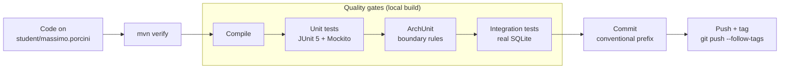

# 9 — DevOps (CI/CD)

**Scope:** there is no CI/CD pipeline infrastructure — none is required (no production deployment, PB §4; §7.4). What exists instead is a **disciplined manual delivery workflow**: every change passes the same local quality gates a pipeline would enforce, and version control follows the course's branch/tag conventions. This section documents that workflow as the project's delivery process.

## Delivery Workflow

> *Auto-generated from PB content — confirmed with the user (2026-09-14).*

**Stages (all local, via `mvn verify`):**

| Stage | Tool | Gate |
|-------|------|------|
| Compile | Maven Compiler Plugin (Java 21) | Zero errors |
| Unit tests | JUnit 5 + Mockito (Surefire) | 100% pass; domain logic exhaustively covered |
| Architecture tests | ArchUnit (see §6.3.4 rules) | Boundary violations fail the build |
| Integration tests | JUnit 5 against real SQLite (Failsafe) | 100% pass |

## Version Control Workflow

- **Branching:** work happens on `student/massimo.porcini`; `main` is the course integration branch. Never commit directly to `main` (course convention, `AGENT.md`).
- **Commits:** conventional prefix `[Agent/Model]: session N - Description in the imperative` (course convention).
- **Milestones:** each session close is marked with an annotated tag `<username>/sN` and pushed with `git push --follow-tags`.
- **PRs:** used for session milestones per course convention; the repository is the course's shared integration point.

## Versioning & Releases

- **Application versioning:** Maven project version, incremented per session milestone (e.g., `0.1.0` after session 2). No runtime version negotiation needed (single consumer).
- **Database schema versioning:** **Flyway** (managed by Spring Boot's dependency management). Rationale: a hand-written numbered SQL runner would reinvent features a mature library already handles — tracking applied migrations, checksum verification (detects accidental modification of an already-applied file), ordering, and idempotence. This does not conflict with YAGNI (principle 5): that principle targets distributed-systems mechanisms (queues, caches, service discovery), not a small, well-tested library solving a definite need. With six PBCs evolving the schema over time, migrations are a requirement from day one, not a speculative one. Migrations live under `src/main/resources/db/migration/` as `V<n>__<description>.sql` and are applied at startup.
- **Artifacts:** the local `mvn package` JAR; no registry.

## Configuration Management

- **Runtime configuration:** Spring Boot `application.yml` — DB file path, server port (default 8080), logging level. No secrets (local-first; §3.4).
- **Environment-specific config:** none — one environment (developer machine).
- **Feature flags:** none — YAGNI (principle 5).
