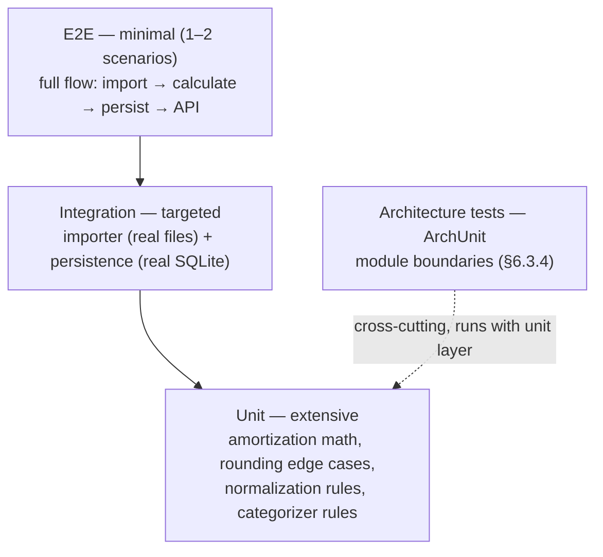

# 10 — Testing Principles

**Philosophy:** test density follows business-rule density. The amortization calculator and the importer's normalization rules concentrate the project's correctness risk, so they get the deepest coverage; the E2E layer exists to prove the system wires together, not to re-test logic already covered below it.

## Test Pyramid

> *Auto-generated from PB content — confirmed with the user (2026-09-14).*

## Layer Specifications

| Layer | Scope | Tools | Depth |
|-------|-------|-------|-------|
| **Unit** | Domain cores: amortization calculator (maximum density — business rules + rounding edge cases), importer normalization, categorizer rule engine, budget thresholds, deduplication | JUnit 5, Mockito | Extensive — exhaustive edge cases, especially `BigDecimal` rounding behavior |
| **Integration** | Importer against real export files (`datasets/` samples); persistence against real SQLite via JDBC | JUnit 5, Spring Boot test slices | Targeted — only where external files and the real DB are involved |
| **E2E** | 1–2 full-flow scenarios: import → amortization calculation → persistence → API exposure | MockMvc / REST Assured | Minimal — validates wiring, no exhaustive coverage at this level |
| **Architecture** | Module boundary rules (§6.3.4): JDBC only in `*.infrastructure`, repository interfaces cross boundaries, `domain` imports nothing from `api`/`infrastructure` | ArchUnit | All rules enforced; violations fail the build |

## Key Testing Principles

1. **Rounding edge cases are first-class.** The amortization tests must cover: exact division, repeating decimals, final-installment residual adjustment, zero/near-zero interest, and boundary loan terms. These tests encode the decided rate/rounding conventions (§6.3.4: nominal annual rate TAN converted to the installment period; half-up rounding to 2 decimals per installment; accumulated rounding difference on the final installment) — the tests are the conventions' executable specification.
2. **The domain is tested without Spring.** Pure JUnit on domain classes (principle 1) — fast, deterministic, no context startup.
3. **Integration tests use the real thing.** Real SQLite file (not mocks, not Testcontainers — CONCERN-002), real sample files from `datasets/`.
4. **Malformed input is a test category of its own.** Importer tests must assert per-row rejection reporting (`ImportResult` with row number + reason), never silent drops (principle 3). The three-state outcome must be covered: accepted, rejected, and *possible duplicate* (fingerprint match without `external_id` — flagged for review, never auto-rejected).
5. **NFR targets are executable tests.** The two performance targets (§3.1) — 1,000 transactions imported in < 5 s; 360-installment schedule in < 1,000 ms — are asserted in the test suite so regressions fail the build.
6. **Error contracts are tested.** Structured error responses (§3) verified via MockMvc: consistent JSON body, no stack traces leaked.

## Coverage Expectations

**Decided:** JaCoCo enabled in the Maven build with a coverage threshold on **domain packages only (≥ 90% line coverage)**; **no global threshold** — infrastructure/api packages are covered via integration/E2E without a hard gate.

Rationale: a global threshold incentivizes shallow, low-value tests (wiring, getters/setters) just to boost numbers; concentrating the gate on `domain` packages targets the logic where correctness matters (amortization, normalization, rules). The safety net for adapter layers is provided by the test pyramid itself — targeted integration tests for importer and persistence (see layers above) — not by a JaCoCo percentage.
